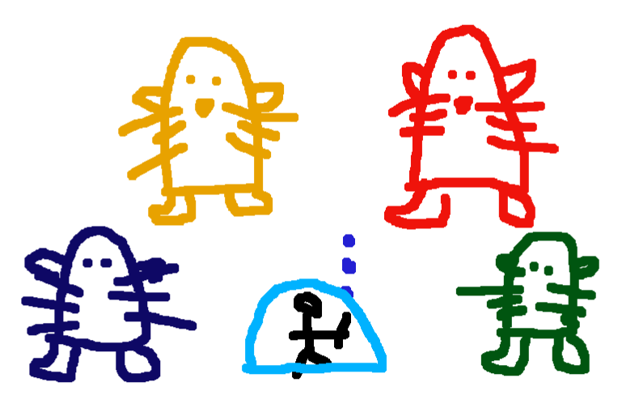
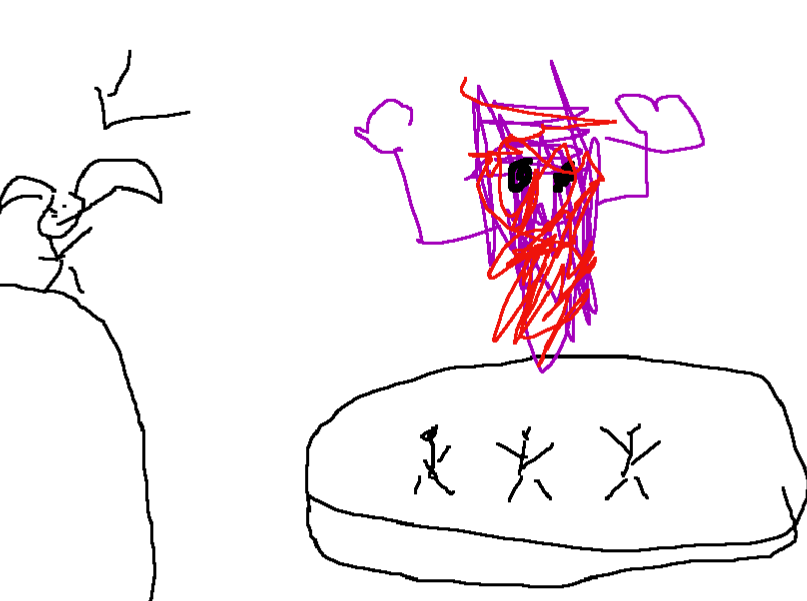
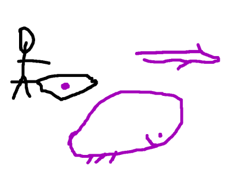
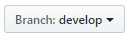

# Liste de mots pour un jeu de dessins sur le thème de Guild Wars 2
_Un project pour des soirées de guildes amusantes._



> English speaker ? Go read **README.md**

* [Comment utiliser](#comment-utiliser) 
* [Comment participer](#comment-participer)
* [Traduction](#traduction)
* [Notes de mise à jour](#notes-de-mise-à-jour)

Mon amour des classiques et du jeu GW2 a planté la graine d'une idée plutôt fun: un **Pictionary** sur le thème de **Guild Wars 2** !

J'ai d'abord essayé d'écrire une liste pour ce [site que permet d'utiliser des listes sur mesures](skribbl.io), mais après quelques parties, nous nous sommes rendus compte que les mêmes mots revenaient souvent, car ma liste n'était finalement pas si longue. Et puis, d'autres guildes pourraient être intéressées, non ? Et si nous partagions ce projet avec d'autres joueurs du monde entier ?

## Tutoriels 

### Comment utiliser
Naviguer dans les dossiers afin de récupérer soit le fichier avec tous les mots (the `ALL_WORDS.md`) ou les catégories spécifiques que vous voulez.
Copier/coller simplement les catégories que vous voulez utiliser dans le site de pictionary. Je conseille _skribbl.io_ mais celui-ci permet de jouer jusqu'à 12 joueurs.  
#### Sur _skribbl.io_
* Créer une partie privée
* Dans la zone de texte, coller simplement les mots à utiliser
* Ne pas oublier de cocher la case "Only use custom words"

### Comment participer

**Merci d'utiliser la bonne branche :**



En ligne, vous pouvez directement éditer les fichers avec vos mots. Ça créera une requête que j'analyserai à la main et l'ajouterai si le contenu me semble correct.

Chaque mot doit être séparé du reste avec une virgule. Les retours charriot ne sont pas pris en compte mais je conseille d'en faire un peu afin d'avoir des fichiers plus lisibles.

Exemple: 
```
sylvari,norn,charr,humain,asura,
kodan,krait,skritt,
```

Merci de respecter l'arborescence :
```BASH
├── [Langue]
|   ├── Normal
|   |   ├── Êtres vivants
|	|   ├── Endroits
|	|   ├── Objets
|	|   ├── Compétences et actions
|	|   ├── Divers
|   ├── Expert
|   |   ├── Êtres vivants
|	|   ├── Endroits
|	|   ├── Objets
|	|   ├── Compétences et actions
|	|   ├── Divers
|   ├── Custom
|	|   ├── TAG - VotreNomDeGuilde
```
**Note:** Je sais que la difficulté dépend du point de vue, mais gardez en tête que certains mots sont vraiment durs à deviner et à dessiner: par exemple une araignée contre Vlast, l'Arche du Lion contre la tour du magicien à Orr. 

#### ATTENTION
Soyez vigilants, en utilisant les mots qui contiennent un caractère `'`,  ils ne s'afficheront pas de la bonne manière sur _skribbl.io_ (peut-être marcheront sur d'autres sites), ils ressembleront à ça :
```
                                mot: Élémentaire d'air
comment il s'affichera dans skribbl: Élémentaire dair
```

## Traduction 
Il n'y a pas de dossier pour votre langage ? N'hésitez pas à demander sa création !

## Notes de mise à jour

#### 0.2
Initialisation du projet avec la liste originelle française. 